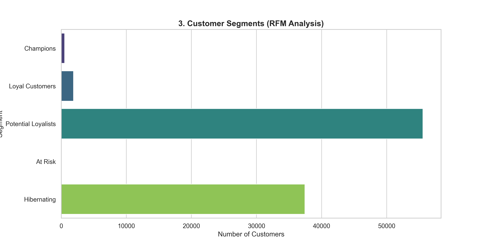
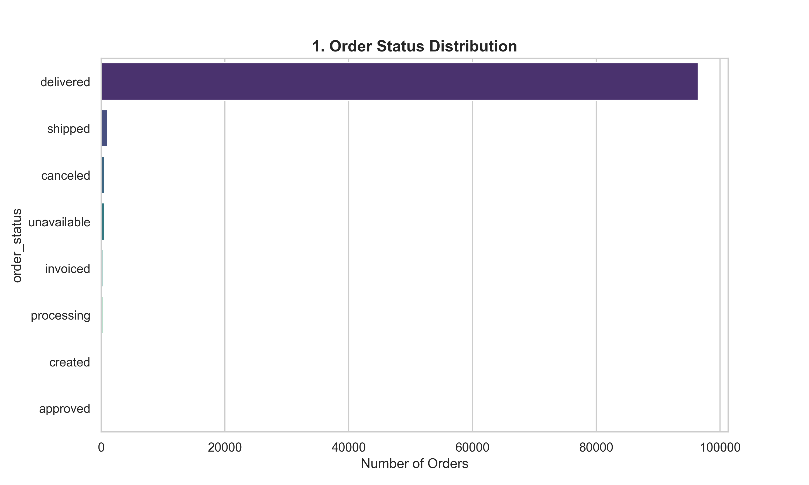
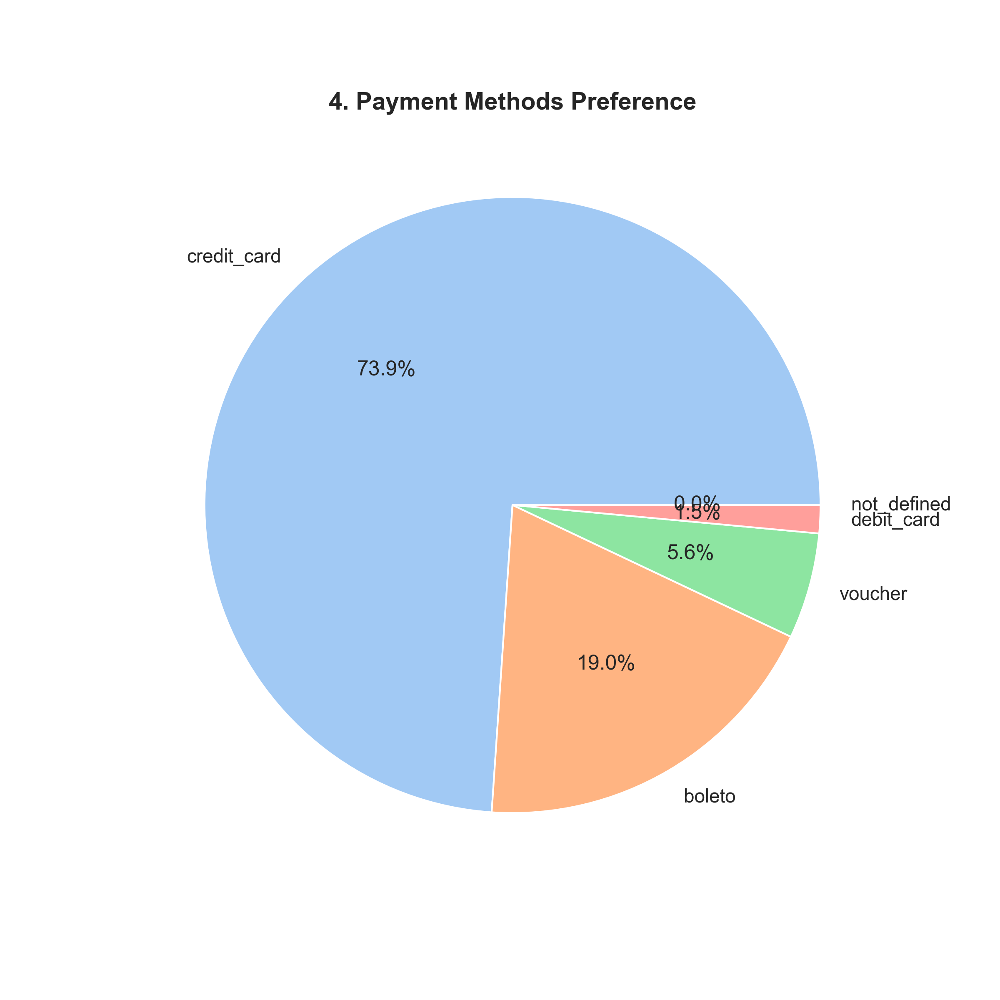

# 🇧🇷 Olist E-Commerce Analytics

  

## 📊 Project Overview
This project analyzes **100,000+ real e-commerce orders** from the Olist Store in Brazil (2016–2018).
The goal was to move beyond simple reporting and perform **Diagnostic Analytics** to answer:
1.  *Who are the most valuable customers?* (RFM Segmentation)
2.  *Where are the logistics bottlenecks?* (Delivery Performance)
3.  *What products drive the Pareto principle?* (80/20 Rule)

* **Data Source:** [Brazilian E-Commerce Public Dataset (Kaggle)](https://www.kaggle.com/datasets/olistbr/brazilian-ecommerce)

## 🛠 Tech Stack
* **Python (3.10+):** Handles Data Loading (ETL) and Visualization.
* **SQLite (Embedded):** Used as the SQL engine to execute complex queries (Window Functions, CTEs) directly on the raw CSV data without requiring external database setup.
* **Libraries:** `pandas` (Data Manipulation), `matplotlib/seaborn` (Visualization), `sqlite3`.

## 🔍 Key Business Insights
1.  **Customer Segmentation:** Using RFM analysis, we identified that **"Champions"** (High spend, recent purchase) make up less than 5% of the user base but drive disproportionate revenue.
2.  **Logistics Friction:** Delivery times vary significantly by state. Remote regions experience delays up to **40% higher** than the national average, directly correlating with lower review scores.
3.  **Category Dominance:** "Bed, Bath, Table" and "Health/Beauty" are the primary revenue drivers, while niche categories show high margins but low volume.

## 📉 Visual Analysis

### 1. Customer Segmentation (RFM Analysis)
*Customers were segmented using "Recency, Frequency, and Monetary" scores. Strategies can now be tailored: e.g., "Win-Back" campaigns for the 'Hibernating' group.*


### 2. Order Status Distribution
*While 97% of orders are delivered, the remaining 3% (canceled/unavailable) represent lost revenue opportunities.*


### 3. Top Product Categories
*Visualizing the top 10 categories by sales volume. These core categories require strict inventory management to prevent stockouts.*


### 4. Payment Preference
*Credit cards are the overwhelming favorite (74%), followed by Boleto (banking ticket).*


## 💻 Advanced SQL Logic
*The analysis relies on complex SQL queries using Window Functions. Below is the logic used for RFM scoring:*

```sql
/* RFM CALCULATION:
Segments users into 5 quintiles (1-5) based on purchase behavior.
*/
WITH customer_stats AS (
    SELECT 
        c.customer_unique_id,
        MAX(o.order_purchase_timestamp) as last_order,
        COUNT(o.order_id) as frequency,
        SUM(p.payment_value) as monetary
    FROM orders o
    JOIN customers c ON o.customer_id = c.customer_id
    JOIN payments p ON o.order_id = p.order_id
    GROUP BY 1
)
SELECT 
    customer_unique_id,
    NTILE(5) OVER (ORDER BY last_order) as r_score, -- 5 is most recent
    NTILE(5) OVER (ORDER BY frequency) as f_score,  -- 5 is most frequent
    NTILE(5) OVER (ORDER BY monetary) as m_score    -- 5 is highest spend
FROM customer_stats;
```
## 🚀 How to Run

### 1) Get the dataset
1. Download the dataset from Kaggle: https://www.kaggle.com/datasets/olistbr/brazilian-ecommerce
2. Extract the CSV files into the `data/` folder (keep the original filenames).

### 2) Install dependencies
```bash
pip install -r requirements.txt

